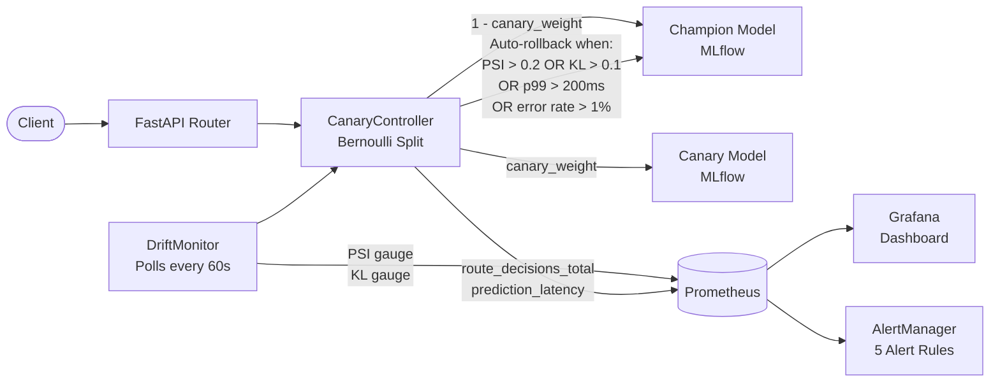

# Architecture

## Problem

Production ML models degrade silently — data distributions shift, upstream pipelines change, and model accuracy erodes without any alert firing. By the time a human notices, the model has been serving bad predictions for hours or days. This project demonstrates a serving platform that detects degradation automatically via statistical drift signals and SLO monitoring, then rolls back to the last known-good model without human intervention.

## System Design

## Key Design Decisions

| Decision | Why |
|----------|-----|
| Bernoulli draw per request (not feature flags) | Stateless — no session affinity needed, works behind any load balancer |
| DriftMonitor injected into CanaryController | Decoupled — swap Evidently for any drift backend without touching routing logic |
| asyncio.create_task in lifespan (not get_event_loop) | Python 3.10+ compatible, task lifecycle tied to app startup/shutdown |
| Public MLflow API only in ModelRegistry | Works against real MLflow server — no test-only private attribute hacks |

## Rollback Conditions

Both signals are independent — either alone triggers rollback:

- **Data drift**: PSI > 0.2 on any input feature
- **Prediction drift**: KL divergence > 0.1 on output score distribution
- **SLO breach**: p99 latency > 200ms OR error rate > 1%

## Test Coverage

69 tests across 9 test files. Strict TDD — failing test written before every implementation file. AST-based inspection used for locustfile tests to avoid gevent/pytest monkey-patch conflict.
