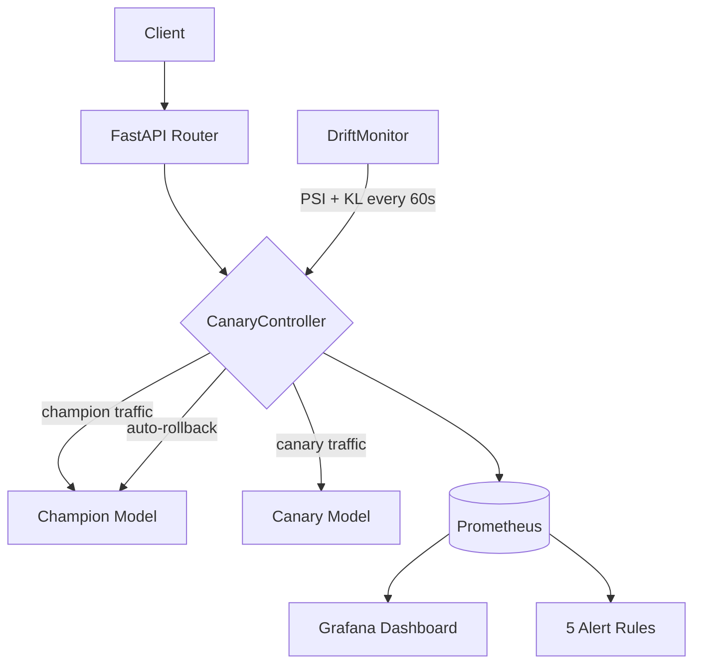

# Sentinel

> Production-grade ML serving pipeline with canary rollout, drift detection, and automatic SLO-based rollback.
> Built by [Pranav Saravanan](https://github.com/pranavss722)

## What This Demonstrates

- **Canary deployments** with Bernoulli traffic splitting (1% → 10% → 50% → 100%)
- **Automatic rollback** on data drift (PSI), prediction drift (KL divergence), or SLO breach (p99 latency / error rate) — no human intervention required
- **Full observability**: Prometheus metrics, Grafana dashboard, 5 alerting rules
- **TDD throughout**: 69 tests, strict red-green-refactor discipline
- **Pre-commit AI safety gate** via OpenAI gpt-4o reviewing staged diffs

## Architecture



## Quickstart

```bash
# Step 1: Start infrastructure
docker-compose up -d

# Step 2: Install the project
pip install -e .

# Step 3: Train and register the baseline model
python scripts/train_baseline.py

# Step 4: Start the serving API
uvicorn app.main:app --reload --port 8000

# Step 5: Run smoke tests
python scripts/smoke_test.py
```

## Running Tests

```bash
python -m pytest tests/ -v
```

Expected: 69 passed

## Load Testing

```bash
# Run against live stack (docker-compose up -d first)
python scripts/run_load_test.py

# Or interactive UI
locust -f locustfile.py --host http://localhost:8000
```

Results saved to `reports/load_test_stats.csv`.

## Tech Stack

| Layer | Technology |
|-------|------------|
| Serving | FastAPI, Uvicorn |
| ML Models | XGBoost, scikit-learn |
| Model Registry | MLflow |
| Drift Detection | Evidently (PSI + KL divergence) |
| Observability | Prometheus, Grafana |
| Load Testing | Locust |
| Pre-commit Review | OpenAI gpt-4o |
