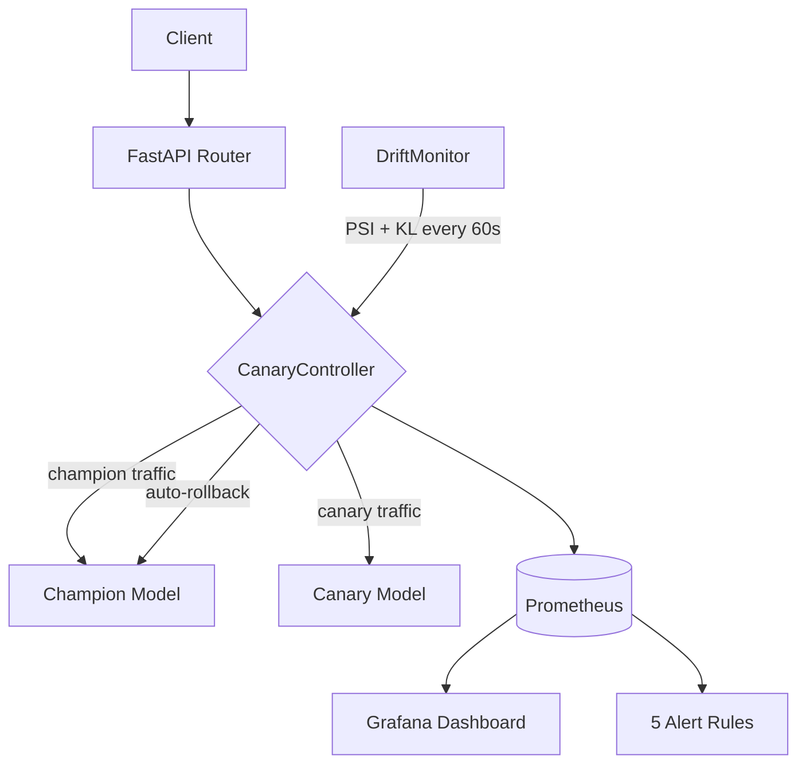

# Sentinel

> - Production-grade ML serving pipeline with canary rollout, drift detection, and automatic SLO-based rollback.
> - A system that watches your models and acts autonomously when something goes wrong.
> - Built by [Pranav Saravanan](https://github.com/pranavss722)

> **What this is — and what it deliberately isn't.** An autonomous model-serving controller — Bernoulli canary rollout, PSI/KL drift detection, and a noise-hardened SLO rollback (minimum-sample floor + sustained-breach debounce) — demonstrated end-to-end with both a drift-immediate and an SLO-debounced rollback path in a deterministic incident replay, plus a watchdog that dogfoods the same engine to monitor real deployed services. It is **not** a platform serving production traffic at scale — the incidents are reproducible exercises against the real controller code, not a live fleet.

## What This Demonstrates

- **Canary deployments** with Bernoulli traffic splitting (1% → 10% → 50% → 100%)
- **Automatic rollback** on data drift (PSI), prediction drift (KL divergence), or SLO breach (p99 latency / error rate) — no human intervention required
- **Noise-resistant SLO rollback**: a minimum-sample floor + sustained-breach debounce (N consecutive polls) so a transient latency spike never tears down a healthy canary
- **Asymmetric rollback policy**: drift (PSI/KL) rolls back immediately (already batch-debounced), SLO rolls back only after N sustained polls — both demonstrated end-to-end
- **State hygiene**: `rollback()` clears the rolling windows, debounce counter, and drift verdict so the next canary starts clean
- **Full observability**: Prometheus metrics, Grafana dashboard, 5 alerting rules
- **Watchdog (dogfooding)**: reuses the same monitoring engine to probe my *own* live demos with SRE multi-window burn-rate alerting, latency-drift (PSI) detection, and push-to-phone alerts — see [Watchdog](#watchdog--monitoring-my-own-services)
- **TDD throughout**: 127 tests, strict red-green-refactor discipline
- **Pre-commit AI safety gate** via OpenAI gpt-4o reviewing staged diffs

## Architecture


```mermaid
flowchart TD
    A[Client] --> B[FastAPI Router]
    B --> C{CanaryController}
    C -->|champion traffic| D[Champion Model]
    C -->|canary traffic| E[Canary Model]
    F[DriftMonitor] -->|PSI + KL every 60s| C
    C --> G[(Prometheus)]
    G --> H[Grafana Dashboard]
    G --> I[5 Alert Rules]
    C -->|auto-rollback| D
```

## Quickstart

```bash
# Step 1: Start infrastructure
docker-compose up -d

# Step 2: Install the project
pip install -e .

# Step 3: Train and register the baseline model
python scripts/train_baseline.py

# Step 4: Start the serving API
uvicorn app.main:app --reload --port 8000

# Step 5: Run smoke tests
python scripts/smoke_test.py
```

## Watch it fail safely

The headline capability — **autonomous rollback** — is fully demonstrable
without the docker stack. One deterministic script stages a realistic incident
against the *real* `CanaryController`, `DriftMonitor`, `ModelRegistry`, and
Prometheus metrics (only the MLflow server is stubbed in-memory):

```bash
pip install -e ".[dev]"
python scripts/demo_incident.py
```

It trains a healthy champion and a deliberately degraded challenger, then stages
**two independent incidents** — each on its own fresh controller — that
demonstrate the controller's deliberately **asymmetric** rollback policy:

- **Scenario A — data drift.** A +6σ covariate shift makes PSI/KL breach. Drift
  is already batch-debounced inside `DriftMonitor`, so the controller rolls back
  **immediately** — on the first poll, **0 polls withheld**.
- **Scenario B — SLO breach.** A degraded challenger saturates the serving path
  (p99 latency + error rate breach) while the input distribution stays stable
  (drift quiet). The rolling SLO signal is spike-prone, so the controller
  **withholds rollback until the breach is confirmed on N consecutive polls**
  (with ≥ min-sample observations) — here **2 polls withheld**, fires on the 3rd.

| Scenario | Trigger | Debounced? | Polls withheld | Time-to-rollback |
|----------|---------|-----------|----------------|------------------|
| A — Drift | PSI/KL | No (batch-debounced) | **0** | immediate (1 poll) |
| B — SLO | p99 / error rate | Yes (N consecutive) | **N-1** | N polls (~N min at 60s) |

Both incidents end with `canary_weight` back to 0, `canary_rollback_total` +1,
100% of traffic restored to the champion, and the controller left **clean** for
the next canary — `rollback()` clears the rolling latency/error windows, resets
the debounce counter, and resets the drift verdict (reference baseline
preserved), so a freshly-promoted canary never inherits a prior incident's state.
Example (Scenario B) timeline:

```
+0.371s [        incident]  Incident begins: degraded challenger saturates serving path — requires 3 consecutive breaching polls
+0.557s [ breach_withheld]  SLO breach observed on poll 1/3 (p99=240ms > 200ms) — rollback WITHHELD
+0.779s [ breach_withheld]  SLO breach observed on poll 2/3 (p99=240ms > 200ms) — rollback WITHHELD
+0.966s [        rollback]  AUTONOMOUS ROLLBACK fired — breach sustained over 3 consecutive polls; canary_weight 0.01 → 0.00
+1.202s [       recovered]  Traffic restored: 500/500 post-rollback requests served by champion (100.0%)
```

The run writes a portfolio-grade artifact to
[`reports/incident_report.md`](reports/incident_report.md) — both timelines, an
asymmetric-policy comparison, a state-hygiene table, postmortem, captured
Prometheus counters, and a two-panel plot
([`reports/incident_timeline.png`](reports/incident_timeline.png)). Both
scenarios are regression-protected by `tests/test_incident_demo.py`, and the
debounce + state hygiene by `tests/test_slo_debounce.py` (including a
negative/transient-breach test that asserts a single spike does **not** roll
back).

## Watchdog — monitoring my own services

The same monitoring engine that guards the in-process model is reused as a
**synthetic-monitoring watchdog** that probes *real deployed services* — I point
it at my **own live demos** (the [rag-ops](https://github.com/pranavss722/rag-ops)
"The Dugout" football-intelligence platform on Railway). It is fully **additive**:
it reuses `app/drift.py`'s PSI engine and the canary SLO/min-sample philosophy
without touching the serving/canary code or its tests.

```bash
# one probe cycle across every target (CI/cron/smoke) — exits non-zero if paging
python scripts/watchdog.py --once

# accelerated windows so a fast-burn PAGE fires in ~12s instead of ~1h
python scripts/watchdog.py --once --profile demo

# long-running daemon (each target probed on its own interval)
python scripts/watchdog.py
```

**Architecture:** `prober → error-budget/SLO → burn-rate → push`

1. **Prober** (`app/watchdog/prober.py`) — probes each target (status + optional
   body assertion + latency). A timeout / 5xx / connection error is recorded as a
   *failed* probe; it never crashes on a down target.
2. **Error-budget + SLO engine** (`app/watchdog/slo.py`) — rolling probe history →
   availability, error budget remaining, and burn rate over multiple windows, plus
   a min-sample-gated hard p99 latency SLO.
3. **Burn-rate alerting** — multi-window multi-burn-rate, fires PAGE / TICKET.
4. **Latency drift** (`app/watchdog/latency_drift.py`) — feeds the rolling latency
   distribution through the **same PSI engine** as the model drift monitor, so a
   latency *regression* (distribution creeping up) is caught **before** the hard
   p99 SLO trips. This is the differentiator vs a plain uptime monitor.
5. **Push sink** (`app/watchdog/alerts.py`) — pushes to my phone on a **state
   transition** (dedup, not every poll) with a recovery notification on the way
   back to healthy.

### SRE multi-window multi-burn-rate design

Implemented faithfully from the Google SRE Workbook chapter
[*Alerting on SLOs*](https://sre.google/workbook/alerting-on-slos/). The **error
budget** for an availability SLO `a` is `1 − a`; the **burn rate** over a window
is `observed_error_rate / (1 − a)` (burn rate 1 = exhaust the whole budget over
the SLO window). A tier fires only when **both** its long window **and** its short
window (1/12 of the long) breach the threshold — the short window keeps the alert
live only while the burn is still happening, auto-resolving stale alerts.

Canonical 30-day production table (`profile: production`):

| Severity | Budget consumed | Long window | Short window | Burn rate | Action |
|----------|-----------------|-------------|--------------|-----------|--------|
| Fast-burn | 2% in 1h | 1h | 5m | **14.4** | PAGE |
| Fast-burn | 5% in 6h | 6h | 30m | **6** | PAGE |
| Slow-burn | 10% in 3d | 3d | 6h | **1** | TICKET |

The **demo profile** (`--profile demo`) preserves the exact thresholds
(14.4 / 6 / 1) and the 1/12 short:long ratio but compresses the windows to
seconds (long windows 12s / 24s / 36s), so a fast-burn PAGE is provokable in
~12s and a slow-burn TICKET in ~36s — for a live demo and for fast tests. The
production windows are documented alongside it in `app/watchdog/config.py`.

### Push to phone (ntfy / Pushover)

Alerts push via **[ntfy](https://ntfy.sh)** by default (or **Pushover**,
env-gated). Endpoints/topics/tokens are read from the environment — never
hardcoded — and if unconfigured, alerts are **logged** instead of pushed (it
never crashes):

```bash
export NTFY_TOPIC=my-secret-topic        # ntfy (default backend)
# export NTFY_SERVER=https://ntfy.sh     # optional self-hosted server
# export PUSHOVER_TOKEN=... PUSHOVER_USER=...   # alternative backend
```

The message states which service, what breached (availability / latency / burn
rate), budget remaining, and burn rate.

### Config

Targets live **only** in [`config/watch_targets.yaml`](config/watch_targets.yaml)
(trivially editable) — `{name, url, method, expected_status, body_check,
latency_slo_ms, availability_slo, interval_seconds}`. Prometheus metrics are
exposed per target (`watchdog_target_up`, `watchdog_probe_latency_ms`,
`watchdog_error_budget_remaining`, `watchdog_burn_rate`, `watchdog_latency_psi`,
`watchdog_alerts_total`) so it slots into the existing Grafana/Prometheus story.

### Where it runs & honest notes

Runs on my laptop (or as a small deployed service / cron via `--once`). The
`demo` profile is a compressed illustration — its budget-percent labels are not
physical; only the burn-rate thresholds and two-window logic carry production
meaning. TLS verification is on by default; a per-target `verify_tls: false`
escape hatch exists for self-signed/internal endpoints or a restricted CA store.
A real `--once` cycle against the live demos returned HTTP 200 for all three
targets (~345–514 ms) at the time of writing.

## Running Tests

```bash
python -m pytest tests/ -v
```

Expected: 127 passed (core + dual-scenario incident + SLO-debounce + state-hygiene
+ watchdog prober/SLO/burn-rate/alert-dedup/latency-drift tests). All watchdog
tests are **hermetic** — mocked probes and a mocked push sink, no real network.

## Load Testing

```bash
# Run against live stack (docker-compose up -d first)
python scripts/run_load_test.py

# Or interactive UI
locust -f locustfile.py --host http://localhost:8000
```

Results saved to `reports/load_test_stats.csv`.

## Tech Stack

| Layer | Technology |
|-------|------------|
| Serving | FastAPI, Uvicorn |
| ML Models | XGBoost, scikit-learn |
| Model Registry | MLflow |
| Drift Detection | Evidently (PSI + KL divergence) |
| Observability | Prometheus, Grafana |
| Load Testing | Locust |
| Pre-commit Review | OpenAI gpt-4o |
