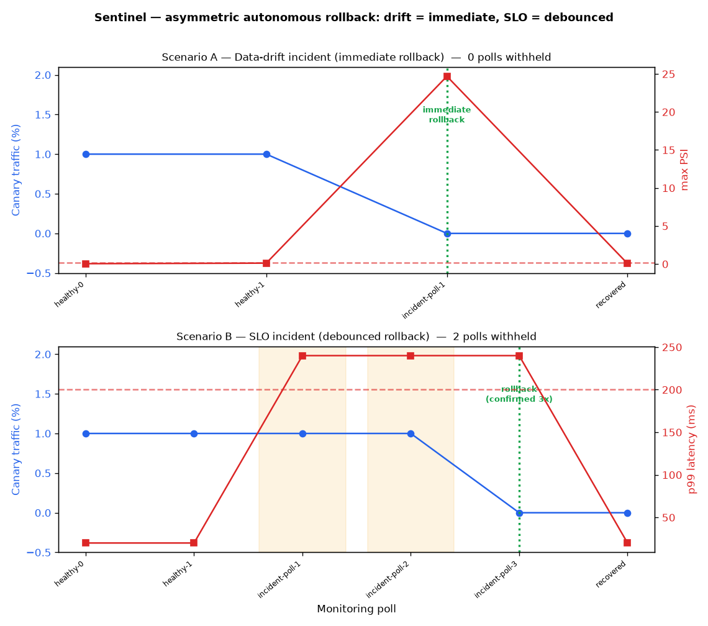

# Incident Report — Autonomous Canary Rollback (both paths)

*Generated: 2026-07-10T22:06:14+00:00 • Scenario: `scripts/demo_incident.py` (deterministic, seed=1337)*

## Summary

Two independent incidents, each on its own fresh `CanaryController`, demonstrate
Sentinel's **deliberately asymmetric** autonomous-rollback policy:

- **Drift (PSI/KL) is batch-debounced inside `DriftMonitor`**, so a breach
  already reflects a sustained distributional shift → the controller rolls back
  **immediately**, on the first poll.
- **The rolling SLO signal (p99 / error rate) is spike-prone**, so the
  controller **withholds rollback until the breach is confirmed on
  3 consecutive polls** — a single transient spike never tears
  down a canary.

Both incidents ended with `canary_weight` back to 0, `canary_rollback_total`
incremented once, 100% of traffic restored to the champion, and the controller
left **clean** for the next canary (windows + debounce + drift verdict reset).

## Asymmetric policy — side by side

| Scenario | Trigger signal | Debounced? | Polls withheld | Time-to-rollback |
|----------|----------------|-----------|----------------|------------------|
| **A — Drift** | PSI[`f3`]=24.69, KL=0.490 | No (already batch-debounced) | **0** | immediate (1 poll, 0 withheld) |
| **B — SLO** | p99=240ms, err=3.55% | Yes (3 consecutive polls) | **2** | 3 polls (~3 min at 60s/poll, 2 withheld) |

*Both scenarios are deterministic (seed=1337) and fire identically on repeat runs.*

## Traffic split & breach signal over both incidents

## Scenario detail

### Scenario A — Data-drift incident (immediate rollback)

**Trigger the controller acted on:** drift threshold exceeded (PSI / KL divergence)
**Detection:** immediate (1 poll, 0 withheld)

| Signal | Value at detection | Threshold | Verdict |
|--------|-------------------|-----------|---------|
| Data drift — PSI[`f3`] | 24.686 | 0.20 | 🔴 BREACH |
| Prediction drift — KL divergence | 0.490 | 0.10 | 🔴 BREACH |
| Latency SLO — p99 | 20 ms | 200 ms | ok (quiet) |
| Error-rate SLO | 0.00 % | 1.00 % | ok (quiet) |

| Invariant | Observed |
|-----------|----------|
| `canary_weight` after rollback | **0.00** (expected 0.00) |
| `canary_rollback_total` delta | **+1** |
| Polls until rollback | **1** |
| Polls withheld | **0** |
| SLO window at detection | **1,200** obs (floor 200) |
| Post-rollback traffic to champion | **500 / 500** (100.0%) |
| **State hygiene** — windows cleared | lat=0, err=0, debounce=0, drift-verdict-cleared=True |

**Timeline**

| Elapsed | Event | Detail |
|---------|-------|--------|
| + 0.000s | `start` | Sentinel serving healthy — champion at 100% traffic |
| + 0.000s | `promotion` | Challenger promoted to canary at 1% |
| + 0.367s | `steady` | Canary healthy over 800 requests — p99=20ms within 200ms SLO, drift within threshold |
| + 0.367s | `incident` | Incident begins: +6 sigma covariate shift on f3 — PSI/KL breach. Drift is batch-debounced, so the controller acts on the FIRST poll (no consecutive-breach wait). |
| + 0.554s | `rollback` | AUTONOMOUS ROLLBACK fired IMMEDIATELY — drift breach (PSI[f3]=24.69 > 0.20, KL=0.490 > 0.10). 0 polls withheld. canary_weight 0.01 → 0.00 |
| + 0.779s | `recovered` | Traffic restored: 500/500 post-rollback requests served by champion (100.0%). Windows cleared (lat=0, err=0), debounce reset (0), drift verdict cleared (True). |

### Scenario B — SLO incident (debounced rollback)

**Trigger the controller acted on:** SLO breach (p99 latency / error rate)
**Detection:** 3 polls (~3 min at 60s/poll, 2 withheld)

| Signal | Value at detection | Threshold | Verdict |
|--------|-------------------|-----------|---------|
| Data drift — PSI[`f3`] | 0.048 | 0.20 | ok (quiet) |
| Prediction drift — KL divergence | 0.020 | 0.10 | ok (quiet) |
| Latency SLO — p99 | 240 ms | 200 ms | 🔴 BREACH |
| Error-rate SLO | 3.55 % | 1.00 % | 🔴 BREACH |

| Invariant | Observed |
|-----------|----------|
| `canary_weight` after rollback | **0.00** (expected 0.00) |
| `canary_rollback_total` delta | **+1** |
| Polls until rollback | **3** |
| Polls withheld | **2** |
| SLO window at detection | **2,000** obs (floor 200) |
| Post-rollback traffic to champion | **500 / 500** (100.0%) |
| **State hygiene** — windows cleared | lat=0, err=0, debounce=0, drift-verdict-cleared=True |

**Timeline**

| Elapsed | Event | Detail |
|---------|-------|--------|
| + 0.000s | `start` | Sentinel serving healthy — champion at 100% traffic |
| + 0.000s | `promotion` | Challenger promoted to canary at 1% |
| + 0.373s | `steady` | Canary healthy over 800 requests — p99=20ms within 200ms SLO, drift within threshold |
| + 0.373s | `incident` | Incident begins: degraded challenger saturates the serving path — p99 latency + error rate breach SLO, input distribution stable (drift quiet). Controller requires 3 consecutive breaching polls before acting. |
| + 0.554s | `breach_withheld` | SLO breach observed on poll 1/3 (p99=240ms > 200ms) — rollback WITHHELD pending confirmation |
| + 0.773s | `breach_withheld` | SLO breach observed on poll 2/3 (p99=240ms > 200ms) — rollback WITHHELD pending confirmation |
| + 0.953s | `rollback` | AUTONOMOUS ROLLBACK fired — SLO breach sustained over 3 consecutive polls (p99=240ms, err=3.55%). canary_weight 0.01 → 0.00 |
| + 1.176s | `recovered` | Traffic restored: 500/500 post-rollback requests served by champion (100.0%). Windows cleared (lat=0, err=0), debounce reset (0), drift verdict cleared (True). |

## State hygiene (window/debounce reset on rollback)

`rollback()` clears the controller's rolling `_latencies`/`_errors` windows,
resets the SLO debounce counter, and resets the `DriftMonitor`'s computed
verdict (its reference baseline is preserved). Without this, a subsequently
promoted canary would inherit the previous incident's samples and could be
judged "in breach" purely from stale state. Observed after rollback:

| Scenario | latencies | errors | debounce counter | drift `should_rollback()` |
|----------|-----------|--------|------------------|---------------------------|
| A — Drift | 0 | 0 | 0 | False |
| B — SLO | 0 | 0 | 0 | False |

## Postmortem

- **Two failure modes, one controller.** A model can go bad by *drifting* (its
  inputs/scores move away from the training distribution) or by *degrading
  service* (latency/errors). Sentinel guards both, autonomously.
- **Why the asymmetry is correct.** PSI/KL are computed over a whole window of
  observations, so a drift breach is already a sustained signal — waiting extra
  poll cycles would only prolong bad serving. A rolling p99, by contrast, can
  spike from a single slow batch; rolling back on one poll would make the system
  trigger-happy. Confirming the SLO breach over 3 polls (each above the
  200-sample floor) trades a few minutes of confirmation for never tearing
  down a healthy canary on noise.
- **State hygiene.** Because `rollback()` clears the windows and the drift
  verdict, the *next* canary starts from a clean slate — the two scenarios in
  this report each began healthy despite the global process having served a
  prior incident.
- **What a human would have done manually.** Notice the alert, confirm the
  regression against a dashboard, decide to roll back, run the promotion tooling
  to reset the alias, and verify traffic drained off the canary — realistically
  **5–15+ minutes** of on-call time per incident. Sentinel does it autonomously:
  instantly for drift, and after a short confirmation window for SLO.

---
*Regression-protected by `tests/test_incident_demo.py` (asserts both paths) and
`tests/test_slo_debounce.py` (debounce + state hygiene).*
